# Design a Payment System (e.g., Stripe / PayPal)

A payment system moves money between parties reliably, exactly once, and without data loss. It must handle distributed failures gracefully — a network timeout between services cannot cause double-charges or lost payments. This problem is fundamentally about correctness over performance.

---

## Requirements

### Functional Requirements

1. Process a payment from a payer to a payee (card charge, bank transfer).
2. Refund or partially refund a completed payment.
3. Query payment status and transaction history.
4. *(Optional)* Multi-currency support and conversion.
5. *(Optional)* Subscription / recurring billing.
6. *(Optional)* Fraud detection before authorization.

### Non-Functional Requirements

- **Exactly-once processing** — a payment must never be charged twice.
- **Consistency** — account balances must always be accurate.
- **Availability** — downtime directly blocks revenue.
- **Auditability** — every state change must be logged immutably.
- **Scale** — 1 M transactions/day; peak 500 TPS.

!!! note "Clarifying scope"
    Ask: *"Should I focus on card payments via a PSP (Stripe), or also internal ledger transfers? Is fraud detection in scope?"*

---

## Capacity Estimation

| Metric | Assumption | Result |
|--------|-----------|--------|
| Peak TPS | 1 M/day with 10× peak factor | **~500 TPS peak** |
| Transaction record | 1 KB per transaction | — |
| Storage per year | 1 M/day × 365 × 1 KB | **~365 GB/year** |
| Idempotency key store | 500 TPS × 86 400 s × 30-day TTL | **~1.3 B keys** (~130 GB in Redis) |

!!! tip "Back-of-envelope shortcut"
    Payment systems are never read-heavy bottlenecks. The challenge is correctness (exactly-once, atomicity), not raw throughput.

---

## API Design

```
POST /api/v1/payments
Headers: Idempotency-Key: client-generated-uuid-v4
Body:  { "payer_id": "u_123", "payee_id": "u_456", "amount_cents": 5000, "currency": "USD", "description": "Order #9876" }
Response 201: { "payment_id": "pay_abc", "status": "PENDING", "created_at": "..." }

GET /api/v1/payments/{payment_id}
Response 200: { "payment_id": "pay_abc", "status": "COMPLETED", "amount_cents": 5000, "completed_at": "..." }

POST /api/v1/payments/{payment_id}/refund
Body:  { "amount_cents": 2500, "reason": "partial_refund" }
Response 200: { "refund_id": "ref_xyz", "status": "PENDING" }
```

---

## Data Model


**Storage choice:** PostgreSQL with strong ACID guarantees. The ledger uses **double-entry bookkeeping** — every payment creates two entries: a debit from payer and a credit to payee. Balances can always be recomputed by summing ledger entries (append-only, immutable).

---

## High-Level Architecture


---

## Key Design Decisions

### Idempotency

The biggest risk in payment systems is double-charging due to retries after network failures.


The client generates a UUID per payment attempt and includes it as `Idempotency-Key`. If the key already exists in Redis, the API returns the cached result without re-processing.

### Transaction Atomicity

A payment involves three operations that must all succeed or all fail:

1. Debit payer's account balance.
2. Credit payee's account balance.
3. Write the payment record with status `COMPLETED`.

These happen in a **single PostgreSQL transaction**:

```sql
BEGIN;
  UPDATE accounts SET balance_cents = balance_cents - 5000 WHERE account_id = 'payer' AND balance_cents >= 5000;
  -- check rows_affected = 1, else ROLLBACK (insufficient funds)
  UPDATE accounts SET balance_cents = balance_cents + 5000 WHERE account_id = 'payee';
  INSERT INTO ledger_entries (...) VALUES (...), (...);
  UPDATE payments SET status = 'COMPLETED' WHERE payment_id = 'pay_abc';
COMMIT;
```

### Handling External PSP Timeouts

When the PSP call times out, we don't know if the charge succeeded:


Never assume failure on timeout. Use a **reconciliation job** to confirm or deny ambiguous transactions within minutes.

---

## Example Interview Dialog

> **Interviewer:** How do you prevent a payment from being processed twice if the client retries after a 504 Gateway Timeout?

> **Candidate:** Idempotency keys are the solution. The client generates a UUID before the first attempt and includes it in every retry of the same request. On the server, before starting any processing, we do a Redis `SET idem:{key} "processing" NX EX 86400`. `NX` makes this atomic — only one request with that key can proceed. If the key already exists, we return the stored result immediately without re-running the payment. If processing fails partway through, we update the Redis value to an error state so retries don't retry a failed-midway transaction incorrectly.

---

> **Interviewer:** How does reconciliation work?

> **Candidate:** Nightly, a reconciliation job queries our internal payment records and compares them against the PSP's settlement file (a CSV of all charges they processed that day). For each discrepancy — a charge the PSP shows but our DB doesn't have as COMPLETED, or vice versa — we raise an alert for manual review. For the common case of a payment stuck in PENDING due to a timeout, the job calls the PSP's "retrieve charge" API, confirms the outcome, and updates our records. This catches any gap between our internal state and what actually moved money.

---

## Deep Dive: Double-Entry Ledger

A double-entry ledger is the foundation of every financial system. Every transaction creates equal and opposite entries:

| Entry | Account | Type | Amount |
|-------|---------|------|--------|
| 1 | Payer `u_123` | DEBIT | -$50.00 |
| 2 | Payee `u_456` | CREDIT | +$50.00 |

**Invariant:** `SUM(all DEBIT entries) + SUM(all CREDIT entries) = 0` at all times.

This allows balance reconstruction from scratch at any point in time and provides a complete audit trail. Ledger rows are immutable — never updated, only appended.

---

## Deep Dive: Fraud Detection

```mermaid
flowchart LR
    Payment["Payment Request"] --> Rules["Rule Engine\n(velocity checks)"]
    Rules --> ML["ML Scoring Model\n(risk score 0–100)"]
    ML -->|"score < 30"| Approve["Approve"]
    ML -->|"30–70"| Challenge["3D Secure\nChallenge"]
    ML -->|"score > 70"| Decline["Decline"]
```



Key signals fed to the ML model: device fingerprint, IP geolocation, transaction velocity (N transactions in last M seconds), shipping/billing address mismatch, and card BIN country vs. IP country. The rule engine handles obvious cases (e.g., 10 transactions in 1 second) at near-zero cost before invoking the more expensive ML model.

---

[:octicons-arrow-left-24: Back: System Design Index](index.md)
