# Design a Rate Limiter

A rate limiter controls the rate of requests a client (or service) can make to an API, protecting backends from abuse, DDoS attacks, and accidental overload. This is a foundational infrastructure component asked frequently at companies like Stripe, Cloudflare, and Uber.

---

## Requirements

### Functional Requirements

1. Limit the number of requests a client can make within a time window (e.g., 100 req/min).
2. Return `HTTP 429 Too Many Requests` when a client exceeds the limit.
3. Support multiple limit rules: per user, per IP, per API key, per endpoint.
4. Rules should be configurable without redeploying the service.

### Non-Functional Requirements

- **Low latency** — the limiter must add < 1 ms overhead per request.
- **Highly available** — a limiter outage should fail open (allow traffic) rather than block all requests.
- **Distributed** — rules must be enforced consistently across all API server replicas.
- **Accurate** — minimize both false positives (blocking legitimate traffic) and false negatives (allowing over-limit traffic).

!!! note "Clarifying scope"
    Ask: *"Should this be a standalone service, or a middleware library embedded in each API server? Is this for a single datacenter or globally distributed?"*

---

## Algorithm Comparison

### 1. Token Bucket

A bucket holds up to `capacity` tokens. Tokens are added at a fixed `refill_rate`. Each request consumes one token. Requests are rejected when the bucket is empty.

```mermaid
flowchart LR
    Refill["Token Refill\n(rate r tokens/sec)"] -->|"add tokens"| Bucket["Token Bucket\n(max capacity C)"]
    Request["Incoming\nRequest"] -->|"consume 1 token"| Bucket
    Bucket -->|"token available"| Allow["✅ Allow"]
    Bucket -->|"empty"| Reject["❌ Reject (429)"]
```



| Property | Value |
|----------|-------|
| **Burst allowed** | Yes — up to `capacity` tokens |
| **Memory** | O(1) per client |
| **Smoothness** | Allows bursts |
| **Used by** | AWS API Gateway, Stripe |

---

### 2. Leaky Bucket

Requests enter a fixed-size queue and are processed at a constant output rate. Requests that would overflow the queue are dropped.

```mermaid
flowchart TD
    Requests["Incoming Requests\n(variable rate)"] -->|"enqueue"| Queue["Leaky Bucket Queue\n(max size Q)"]
    Queue -->|"process at constant rate r"| Output["✅ Processed Output"]
    Requests -->|"queue full"| Reject["❌ Reject (429)"]
```



| Property | Value |
|----------|-------|
| **Burst allowed** | No — output is constant |
| **Memory** | O(Q) queue size |
| **Smoothness** | Very smooth output |
| **Used by** | NGINX rate limiting |

---

### 3. Fixed Window Counter

Divide time into fixed windows (e.g., each minute). Count requests per window. Reset counter at window boundary.

```mermaid
flowchart LR
    T["Time →"] --> W1["Window 1\n00:00–01:00\ncount: 98"]
    W1 --> W2["Window 2\n01:00–02:00\ncount: 3"]
    W2 --> W3["Window 3\n02:00–03:00\ncount: 0"]
    Request["Request at\n00:59:59"] -->|"+1"| W1
```



!!! warning "Boundary burst vulnerability"
    A client can send 100 requests at 00:59:59 and 100 more at 01:00:01 — passing 200 requests through a 100 req/min limit. This is the key weakness of fixed windows.

| Property | Value |
|----------|-------|
| **Burst allowed** | Yes (at window boundaries) |
| **Memory** | O(1) per client |
| **Accuracy** | Low (boundary problem) |

---

### 4. Sliding Window Log

Store a timestamp log of every request. On each new request, discard timestamps older than the window, then check if the count exceeds the limit.

```mermaid
flowchart LR
    NewReq["New Request\n@ T=100s"] --> Prune["Remove timestamps\n< T - 60s (< 40s)"]
    Prune --> Log["Timestamp Log\n[42s, 55s, 78s, 99s]"]
    Log -->|"count ≤ limit"| Allow["✅ Allow\nAppend 100s"]
    Log -->|"count > limit"| Reject["❌ Reject (429)"]
```



| Property | Value |
|----------|-------|
| **Burst allowed** | No — accurate sliding window |
| **Memory** | O(requests in window) per client — **high** |
| **Accuracy** | High |
| **Used by** | Low-volume systems where accuracy matters most |

---

### 5. Sliding Window Counter (Hybrid)

Combine fixed window counters from the current and previous window, weighted by how far into the current window we are.

```
estimated_count = prev_window_count × (1 - elapsed_fraction) + curr_window_count
```

**Example:** Limit = 100/min. Previous window count = 80. Current window count = 30. We're 25% into the current window.
`estimated = 80 × 0.75 + 30 = 60 + 30 = 90` → allow (< 100).

| Property | Value |
|----------|-------|
| **Burst allowed** | Controlled |
| **Memory** | O(1) per client (two counters) |
| **Accuracy** | High (approximation is within ~1%) |
| **Used by** | Cloudflare, recommended for most production systems |

---

### Algorithm Comparison Table

| Algorithm | Memory | Accuracy | Burst | Complexity | Recommended For |
|-----------|--------|----------|-------|------------|-----------------|
| Token Bucket | Low | Medium | ✅ Yes | Low | APIs that allow burst |
| Leaky Bucket | Medium | High | ❌ No | Medium | Smooth output required |
| Fixed Window | Low | Low | ✅ Yes | Very Low | Simple, non-critical limits |
| Sliding Window Log | High | High | ❌ No | Medium | Low-volume, high accuracy |
| Sliding Window Counter | Low | High | Partial | Low | **Most production systems** |

---

## High-Level Architecture

```mermaid
flowchart TD
    Client["👤 Client"] --> LB["Load Balancer"]
    LB --> API1["API Server 1"]
    LB --> API2["API Server 2"]
    LB --> API3["API Server 3"]
    API1 --> RL["Rate Limiter\nMiddleware"]
    API2 --> RL
    API3 --> RL
    RL -->|"read/write counters"| Redis["Redis Cluster\n(shared state)"]
    RL -->|"fetch rules"| Rules["Rules Cache\n(local in-process)"]
    Rules -->|"refresh every 60s"| RulesDB["Rules Store\n(Config DB)"]
    RL -->|"allowed"| Backend["Backend Services"]
    RL -->|"blocked"| Client

    style Redis fill:#b5651d,color:#fff
    style RL fill:#1e3a5f,color:#fff
```



**Why Redis?** Redis supports atomic increment operations (`INCR`, `EXPIRE`) and Lua scripts, making it ideal for implementing counters with sub-millisecond latency.

---

## Distributed Rate Limiting Challenges

### The Synchronization Problem

When multiple API server replicas each maintain local counters, a client can spread requests across servers to bypass limits.


**Solution:** Use a **centralized Redis cluster** as the shared counter store. All servers atomically read and increment the same counter.

### Redis Atomic Counter Pattern

```lua
-- Lua script executed atomically in Redis
local key = KEYS[1]          -- e.g., "ratelimit:user123:1700000060"
local limit = tonumber(ARGV[1])
local window = tonumber(ARGV[2])

local count = redis.call("INCR", key)
if count == 1 then
    redis.call("EXPIRE", key, window)
end
if count > limit then
    return 0  -- rejected
end
return 1  -- allowed
```

### Race Conditions

The `INCR` + `EXPIRE` sequence must be atomic. Use a **Lua script** (executed atomically by Redis) or a Redis pipeline to avoid a race where the key is incremented but never given a TTL.

### Fail-Open vs Fail-Closed

| Strategy | Behavior on Redis Outage | Risk |
|----------|--------------------------|------|
| **Fail-open** | Allow all requests | DDoS exposure during outage |
| **Fail-closed** | Block all requests | Legitimate traffic blocked |

!!! tip "Recommended: fail-open with local fallback"
    Keep a **local in-process counter** as a fallback. If Redis is unreachable, apply a conservative local limit (e.g., 50% of normal limit). This limits DDoS exposure without blocking all legitimate traffic.

---

## Redis-Based Implementation Sketch

```python
import redis
import time

r = redis.Redis(host="redis-cluster", decode_responses=True)

def is_allowed(user_id: str, limit: int, window_seconds: int) -> bool:
    now = int(time.time())
    window_start = now - (now % window_seconds)
    key = f"ratelimit:{user_id}:{window_start}"

    lua_script = """
    local count = redis.call('INCR', KEYS[1])
    if count == 1 then
        redis.call('EXPIRE', KEYS[1], ARGV[2])
    end
    if count > tonumber(ARGV[1]) then
        return 0
    end
    return 1
    """
    result = r.eval(lua_script, 1, key, limit, window_seconds)
    return bool(result)

# Usage
if not is_allowed(user_id="user_123", limit=100, window_seconds=60):
    return HTTPResponse(429, headers={"Retry-After": "60"})
```

!!! note "Response headers"
    Always return informative headers on both allowed and rejected responses:

    ```
    X-RateLimit-Limit: 100
    X-RateLimit-Remaining: 42
    X-RateLimit-Reset: 1700001000
    Retry-After: 18   (only on 429)
    ```

---

## Example Interview Dialog

> **Interviewer:** Why not just use a database instead of Redis for the counters?

> **Candidate:** The rate limiter sits on the **critical path** of every single API request. A traditional relational database would add 5–20 ms per request for a simple counter increment, which is unacceptable. Redis operates in-memory with sub-millisecond latency. The counter operations — `INCR` and `EXPIRE` — map directly to Redis primitives, and Lua scripts let us execute multi-step logic atomically without round trips.

---

> **Interviewer:** How would you implement per-endpoint rate limits that are different from per-user limits?

> **Candidate:** I'd use a **composite key** that includes both the entity being limited and the resource: `ratelimit:{user_id}:{endpoint}:{window}`. Rules are stored in a config store and cached in-process on each API server, refreshed every 60 seconds. On each request, the middleware looks up the applicable rule — most specific match wins, falling back to a global default. This gives us fine-grained control without a cache lookup on every request.

---

> **Interviewer:** What if you need to rate-limit across multiple data centers?

> **Candidate:** This is genuinely hard. Synchronizing counters globally would add cross-datacenter latency to every request. The pragmatic trade-off is to enforce limits **per region**, with each region getting a fraction of the global limit (e.g., a 1000 req/min global limit might become 400/400/200 across three regions based on traffic share). For stricter global enforcement, you'd need a consistent global store like Google Spanner or a gossip-based approximate counter, accepting either higher latency or weaker accuracy.

---

[:octicons-arrow-left-24: Back: URL Shortener](url-shortener.md) · [:octicons-arrow-right-24: Next: Twitter Feed](twitter-feed.md)
