# Design a Recommendation Engine (e.g., Netflix / Spotify)

A recommendation engine surfaces personalized content to users based on their historical behavior and the behavior of similar users. At scale, the system must train on billions of interactions, serve low-latency recommendations to hundreds of millions of users, and balance exploration (new content) with exploitation (known preferences).

---

## Requirements

### Functional Requirements

1. Return a ranked list of recommended items (movies, songs, products) for a given user.
2. Recommendations update as the user interacts (plays, skips, likes, rates).
3. *(Optional)* Explain why an item was recommended ("Because you watched X").
4. *(Optional)* Trending / popular content as fallback for new users.
5. *(Optional)* Similar-item recommendations ("More like this").

### Non-Functional Requirements

- **Low latency** — recommendation API responds in < 100 ms.
- **Freshness** — new interactions should influence recommendations within hours.
- **Scale** — 200 M users, 10 M items, 1 B interaction events/day.
- **Cold start** — handle new users and new items with no history.

!!! note "Clarifying scope"
    Ask: *"Is this for collaborative filtering (user-based) or content-based filtering, or both? How fresh do recommendations need to be — real-time or nightly batch?"*

---

## Capacity Estimation

| Metric | Assumption | Result |
|--------|-----------|--------|
| Interaction events | 1 B/day / 86 400 s | **~11 600 writes/sec** |
| Recommendation reads | 200 M users × 5 requests/day / 86 400 s | **~11 600 reads/sec** |
| Model matrix | 200 M users × 256-dim embedding | **~200 GB embeddings** |
| Item embeddings | 10 M items × 256-dim embedding | **~10 GB** |
| Batch training cycle | Daily full retrain | — |

!!! tip "Back-of-envelope shortcut"
    Pre-computing and caching recommendations for all users (200 M × ~50 items × 8 bytes ID) requires ~80 GB — feasible in a Redis cluster. Avoid computing recs at query time.

---

## API Design

```
GET /api/v1/recommendations?user_id=u_123&context=homepage&limit=20
Response 200:
{
  "user_id": "u_123",
  "recommendations": [
    { "item_id": "m_456", "score": 0.97, "reason": "trending_in_your_genre" },
    { "item_id": "m_789", "score": 0.94, "reason": "similar_users_liked" }
  ],
  "model_version": "v20250115"
}

POST /api/v1/events
Body:  { "user_id": "u_123", "item_id": "m_456", "event_type": "PLAY", "timestamp": 1700000000, "progress_pct": 85 }
Response 202

GET /api/v1/items/{item_id}/similar?limit=10
Response 200: { "similar_items": [{ "item_id": "m_999", "score": 0.88 }] }
```

---

## Data Model


**Storage choice:** Interactions in Cassandra (high write throughput, time-ordered). Embeddings in a vector database (Pinecone, Weaviate, or pgvector) for approximate nearest-neighbor (ANN) search. Pre-computed recs in Redis.

---

## High-Level Architecture


---

## Key Design Decisions

### Algorithm Comparison

```mermaid
flowchart TD
    A["Recommendation\nApproach"] --> CF["Collaborative Filtering\n(user-user or item-item)"]
    A --> CB["Content-Based Filtering\n(item features)"]
    A --> MF["Matrix Factorization\n(SVD, ALS)"]
    A --> DL["Deep Learning\n(two-tower model)"]

    CF --> CF_Pro["✅ No item metadata needed\n✅ Discovers non-obvious patterns"]
    CF --> CF_Con["❌ Cold start for new users/items\n❌ Sparsity problem"]
    CB --> CB_Pro["✅ No cold start for new items\n✅ Explainable"]
    CB --> CB_Con["❌ Over-specializes\n❌ No serendipity"]
    MF --> MF_Pro["✅ Compact user/item embeddings\n✅ Handles sparse matrices well"]
    DL --> DL_Pro["✅ Captures complex patterns\n✅ Industry standard at scale"]
    DL --> DL_Con["❌ Expensive to train\n❌ Black-box explanations"]
```



**Production standard:** A **two-tower neural network** — one tower encodes user context, one encodes item features — both project to the same embedding space. Recommendation = find items with highest cosine similarity to the user embedding.

### Batch vs. Real-Time

| Layer | Approach | Freshness | Notes |
|-------|----------|-----------|-------|
| **Long-term model** | Batch retrain daily | 24 hours | Deep embeddings from all history |
| **Short-term features** | Stream processing | Minutes | Recent interactions update feature store |
| **Session context** | Real-time at query | Seconds | Last 5 interactions influence ranking |

The three layers are combined at serving time to produce fresh, personalized results without requiring real-time model training.

### Cold Start Problem

| Scenario | Strategy |
|----------|----------|
| New user, no history | Serve popular/trending items; ask onboarding preferences |
| New item, no interactions | Use content-based features; add to a "new releases" bucket |
| User after long absence | Re-weight recent interactions more heavily (time-decay) |

---

## Example Interview Dialog

> **Interviewer:** How does your system serve recommendations in under 100 ms when you have 200 million users?

> **Candidate:** I pre-compute recommendations for all active users in a nightly batch job and store the top-100 results per user in Redis: `SET rec:{user_id} [sorted item list]`. The Recommendation API is just a Redis GET — sub-millisecond. The 100 ms budget is mostly network overhead. For users who are not in the cache (e.g., new user logged in 10 minutes ago), the API falls back to an ANN search in the vector database: compute the dot product of the user's embedding against all 10 M item embeddings using approximate nearest-neighbor search (HNSW index), which returns the top-100 in ~20 ms.

---

> **Interviewer:** How do you handle the cold start problem for a brand new user?

> **Candidate:** Three phases: First, during onboarding, ask the user to pick 3–5 genres or seed items they like. These become the initial "pseudo-interactions." Second, fall back to popularity — trending content with demographic targeting (country, language) ensures the first session is reasonable. Third, after the user has accumulated ~20 interactions, they have enough signal to be included in the next model training cycle, after which personalized embeddings are generated. The user transitions from popularity-based to collaborative-filtering-based recommendations within the first day of use.

---

## Deep Dive: Two-Tower Model Architecture


Training objective: maximize the score between a user and items they interacted with (positive examples) versus randomly sampled items (negative examples). Training data = interaction log from Kafka → Spark → daily training job on GPU cluster.

---

## Deep Dive: Exploration vs. Exploitation (ε-greedy)

Always recommending the highest-scored items creates a filter bubble. To introduce serendipity:

```
For each recommendation request:
  with probability (1 - ε): recommend top-scored items (exploit)
  with probability ε:       recommend a randomly sampled item
                            from outside the user's usual categories (explore)

ε is typically 0.1–0.2 (10–20% exploration rate)
```

Measure exploration success by tracking long-term engagement with "explored" items. Items that consistently fail exploration are downweighted in the candidate set.

---

[:octicons-arrow-left-24: Back: System Design Index](index.md)
