# Design a Ride-Sharing Service (e.g., Uber / Lyft)

A ride-sharing platform matches riders requesting a trip with nearby drivers in real-time, tracks vehicle locations continuously, and manages the full trip lifecycle from request to payment. This problem tests location indexing, real-time matching, and consistency under concurrent updates.

---

## Requirements

### Functional Requirements

1. Riders can request a ride from their current location to a destination.
2. The system finds and matches the nearest available driver.
3. Drivers can accept or decline a match request.
4. Both rider and driver can track each other's real-time location during the trip.
5. *(Optional)* Surge pricing based on supply/demand.
6. *(Optional)* Trip history, ratings, payments.

### Non-Functional Requirements

- **Low latency** — match must complete in < 5 seconds.
- **High availability** — service unavailability directly loses revenue.
- **Consistency** — a driver must not be double-matched.
- **Scale** — 10 M daily trips; 1 M concurrent drivers updating location every 4 seconds.

!!! note "Clarifying scope"
    Ask: *"Should I focus on the matching algorithm or also on the payment and rating systems? Is surge pricing in scope?"*

---

## Capacity Estimation

| Metric | Assumption | Result |
|--------|-----------|--------|
| Driver location updates | 1 M drivers × 15 updates/min | **~250 000 writes/sec** |
| Location data size | 1 M drivers × 50 bytes | **~50 MB in-memory snapshot** |
| Trip requests | 10 M trips/day / 86 400 s | **~115 requests/sec** |
| Match latency target | P99 < 5 s | — |

!!! tip "Back-of-envelope shortcut"
    250 k location writes/sec sounds high but each write is tiny (≤ 100 bytes). A Redis cluster can comfortably handle 500 k–1 M small writes/sec.

---

## API Design

```
POST /api/v1/rides/request
Body:  { "rider_id": "r_123", "origin": { "lat": 37.77, "lng": -122.41 }, "destination": { "lat": 37.78, "lng": -122.40 } }
Response 202: { "ride_id": "ride_abc", "status": "SEARCHING", "estimated_wait_secs": 90 }

PUT /api/v1/drivers/{driver_id}/location
Body:  { "lat": 37.771, "lng": -122.412, "heading": 270, "speed_mph": 18 }
Response 204

PUT /api/v1/rides/{ride_id}/accept
Body:  { "driver_id": "d_456" }
Response 200: { "ride_id": "ride_abc", "status": "ACCEPTED", "driver_eta_secs": 120 }

GET /api/v1/rides/{ride_id}/status
Response 200: { "ride_id": "ride_abc", "status": "IN_PROGRESS", "driver_location": { "lat": 37.770, "lng": -122.413 } }
```

---

## Data Model


**Storage choice:** Trip records in PostgreSQL (strong consistency for billing). Driver locations in Redis sorted sets with geospatial support — ephemeral, updated every 4 seconds, queried by radius for matching.

---

## High-Level Architecture


---

## Key Design Decisions

### Geospatial Indexing: Geohash vs. Quadtree vs. H3

```mermaid
flowchart TD
    A["Find drivers within 5 km?"] --> B{"Indexing approach"}
    B -->|"Option 1"| Geo["Geohash\n(encode lat/lng to string)"]
    B -->|"Option 2"| QT["Quadtree\n(recursive grid)"]
    B -->|"Option 3"| H3["H3 Hexagons\n(Uber's library)"]

    Geo --> G_Pro["✅ Easy prefix search\n✅ Redis GEOSEARCH built-in"]
    Geo --> G_Con["❌ Edge distortion at cell borders\n(use neighbor cell lookup)"]
    QT --> Q_Pro["✅ Adapts to density\n✅ No border artifact"]
    QT --> Q_Con["❌ Complex tree maintenance\n❌ Not trivially distributed"]
    H3 --> H_Pro["✅ Equal-area cells\n✅ Hierarchical\n✅ Production-proven at Uber"]
    H3 --> H_Con["❌ External library dependency"]
```



**Recommended:** Use Redis `GEOSEARCH` (built on geohash internally) for simplicity. At Uber's scale, H3 hexagonal grids are preferred for equal-area properties.

### Driver Matching Algorithm

1. Find all drivers with `status = AVAILABLE` within a radius (start at 2 km, expand to 5 km if none found).
2. Score candidates: `score = distance_penalty + accept_rate_bonus + rating_bonus`.
3. Send push notification to the top candidate. Give them 10 seconds to accept.
4. If declined or no response, move to the next candidate.
5. Lock the driver atomically in Redis (`SET driver:{id}:locked 1 NX EX 15`) to prevent double-matching.

### Surge Pricing

Surge multiplier is computed per geohash cell:

```
surge = max(1.0, demand_requests / supply_available_drivers)
```

Recomputed every 30 seconds using a sliding window count from Kafka streams. Rider is shown the surge multiplier before confirming; they must explicitly accept.

---

## Example Interview Dialog

> **Interviewer:** How do you prevent the same driver from being matched to two rides simultaneously?

> **Candidate:** I use a Redis `SET driver:{driver_id}:locked 1 NX EX 15` command. `NX` means "set only if not exists" — this is an atomic compare-and-set. The first match service instance to acquire the lock wins; others see the key already exists and skip that driver. The TTL of 15 seconds is slightly longer than the driver's acceptance window, so if the driver never responds, the lock automatically expires and the driver becomes available again. When the driver accepts, we update their status to `BUSY` in the DB and release the Redis lock.

---

> **Interviewer:** How does real-time location tracking work at scale with 1 million active drivers?

> **Candidate:** Each driver app sends a UDP-like location beacon every 4 seconds to a fleet of Location Service nodes. These nodes write directly to Redis using `GEOADD`, which is a sorted set operation — O(log N) per update. With 250 k updates/sec, a Redis cluster with 5–10 nodes handles this comfortably. We don't need strong durability for location data — if we lose a few seconds of updates during a failover, the next beacon catches us up. For the rider's tracking view, the Trip Service subscribes to a per-trip Redis pub/sub channel and pushes location updates over WebSocket.

---

## Deep Dive: Trip State Machine


State transitions are persisted to PostgreSQL with optimistic locking (`version` column) to prevent concurrent state corruption if two services attempt to transition simultaneously.

---

## Deep Dive: ETA and Route Calculation

Estimated time of arrival is computed using a road graph:


Road graph is stored as an adjacency list in a graph database or custom binary format. Traffic-adjusted weights are updated every 30 seconds from aggregated GPS probe data (anonymized driver locations). ETA calls are cached per `(origin_geohash_7, destination_geohash_7)` pair for 60 seconds.

---

[:octicons-arrow-left-24: Back: System Design Index](index.md)
