# Design Search Autocomplete / Typeahead (e.g., Google Search)

A typeahead system returns the top-k query suggestions as the user types, typically within 100 ms. It must handle billions of daily queries, personalize results, and update suggestions in near-real-time as new search trends emerge.

---

## Requirements

### Functional Requirements

1. As the user types each character, return the top-5 matching query suggestions.
2. Suggestions are ranked by global query popularity (frequency).
3. *(Optional)* Personalize suggestions based on user history.
4. *(Optional)* Support multiple languages / locales.
5. *(Optional)* Filter out offensive or blacklisted terms.

### Non-Functional Requirements

- **Low latency** — suggestions must arrive in < 100 ms end-to-end.
- **High availability** — autocomplete outage degrades search UX visibly.
- **Eventual consistency** — suggestion data can lag real traffic by minutes or hours.
- **Scale** — 10 M active users, ~50 keystrokes per search session, ~5 B suggestion requests/day.

!!! note "Clarifying scope"
    Ask: *"Is personalization required? What's the acceptable staleness for suggestion updates — minutes or hours?"*

---

## Capacity Estimation

| Metric | Assumption | Result |
|--------|-----------|--------|
| Suggestion QPS | 5 B requests / 86 400 s | **~58 000 QPS** |
| Avg query length | 20 chars → 20 keystrokes per query | — |
| Trie node storage | 500 k unique prefixes × 1 KB | **~500 MB working set** |
| Suggestion update lag | Batch job every 30 min | Acceptable for most use cases |

!!! tip "Back-of-envelope shortcut"
    At 60 k QPS with ~100 B data per response, bandwidth is ~6 GB/s — spread across many CDN edge nodes this is manageable.

---

## API Design

```
GET /api/v1/suggestions?q=appl&limit=5&locale=en-US
Response 200:
{
  "query": "appl",
  "suggestions": [
    { "text": "apple", "score": 982341 },
    { "text": "apple store", "score": 874210 },
    { "text": "apple music", "score": 751009 }
  ]
}
```

---

## Data Model


**Storage choice:** Trie nodes are held in-memory (Redis or a custom trie service). The `SUGGESTION` table acts as a persistent snapshot: each prefix maps to a pre-computed JSON blob of top-k results, updated by a batch aggregation job.

---

## High-Level Architecture


---

## Key Design Decisions

### Trie vs. Prefix Hash Map

```mermaid
flowchart TD
    A["Prefix lookup strategy?"] --> B{"Structure"}
    B -->|"Option 1"| Trie["Trie\n(character tree)"]
    B -->|"Option 2"| Hash["Hash Map\nprefix → top-k"]
    B -->|"Option 3"| ES["Elasticsearch\nprefix query"]

    Trie --> T_Pro["✅ Memory efficient for shared prefixes\n✅ Incremental traversal"]
    Trie --> T_Con["❌ Complex distributed sharding\n❌ Rebalancing on update"]
    Hash --> H_Pro["✅ O(1) lookup\n✅ Easy to cache in Redis"]
    Hash --> H_Con["❌ Stores every prefix explicitly\n❌ Large storage footprint"]
    ES --> E_Pro["✅ Full-text search, fuzzy matching\n✅ Easy ranking"]
    ES --> E_Con["❌ Higher latency than in-memory trie\n❌ Heavyweight infra"]
```



**Recommended:** Pre-compute top-k suggestions for every prefix and store them as a flat hash map in Redis. The trie is only used internally by the aggregation job to derive those top-k lists. This gives O(1) Redis lookups with minimal complexity.

### Ranking Signals

| Signal | Weight | Notes |
|--------|--------|-------|
| Global query frequency | High | Counted in 24-hour rolling window |
| Recency boost | Medium | Trending queries get a time-decay multiplier |
| Personalization | Low–Medium | User's last 30 days of searches (opt-in) |
| Diversity | Low | De-duplicate suggestions with same head word |

### Update Strategies: Batch vs. Real-Time

| Approach | Latency | Complexity |
|----------|---------|------------|
| **Batch (Spark)** every 30 min | 30 min lag | Low — simple job |
| **Mini-batch (Flink)** every 1 min | 1 min lag | Medium |
| **Real-time (streaming)** | Seconds | High — trie mutations under lock |

For most production systems, a 30-minute batch cadence is sufficient. Real-time is only needed for trending events (news, sports).

---

## Example Interview Dialog

> **Interviewer:** How would you handle a sudden trending query like a breaking news event that needs to appear in suggestions within seconds?

> **Candidate:** For the vast majority of queries, batch updates every 30 minutes are fine. For trending detection I'd add a streaming layer: a Flink job counts queries in a 1-minute tumbling window and compares against a baseline. If a term's frequency spikes by more than 10×, it's pushed directly to a "trending" overlay in Redis, bypassing the main trie. The suggestion API merges the trending set with normal top-k results. This keeps the fast path simple while still handling viral events.

---

> **Interviewer:** How do you scale the trie service when you have 60 000 QPS?

> **Candidate:** The trie (or prefix hash map) is read-only between batch updates, so we can scale horizontally. I'd shard by the first character of the prefix — 26 shards for English gives roughly 2 300 QPS per shard. Each shard is a Redis node with a replica for HA. During the batch update, we write to a shadow Redis cluster and then do an atomic pointer swap (rename in Redis), so there's zero downtime during updates.

---

> **Interviewer:** How would you handle offensive or inappropriate suggestions?

> **Candidate:** Maintain a blacklist table. Before writing computed top-k results to Redis, the aggregation job filters out any term matching the blacklist. The blacklist is a small set, so filtering is cheap. For user-reported terms I'd add a moderation queue that asynchronously adds entries to the blacklist; the next batch run will purge them from the suggestion store.

---

## Deep Dive: Distributed Trie Sharding

A single in-memory trie for all English queries can reach 1–5 GB. To scale:


**Hotspot risk:** Prefixes like `"the"` and `"how"` are queried far more than `"xyz"`. To avoid hotspots, shard by a **hash of the first two characters** rather than alphabetical range. Monitor per-shard QPS and rebalance shards as needed.

---

## Deep Dive: Caching at the CDN Edge

Popular prefixes (e.g., `"weath"`, `"best"`) account for the majority of traffic. CDN edge caching dramatically reduces origin load:

- Cache key: `(prefix, locale)` — never include `user_id` (that would bypass caching).
- TTL: 5 minutes for normal suggestions; 30 seconds for trending.
- Cache invalidation: On each batch update, issue a CDN surrogate-key purge for changed prefixes.
- Hit rate expectation: ~80% for the top 1 000 most-queried prefixes.

---

[:octicons-arrow-left-24: Back: System Design Index](index.md)
