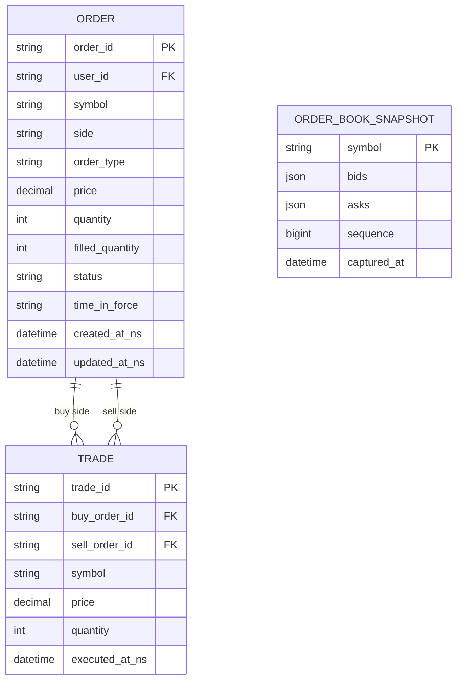
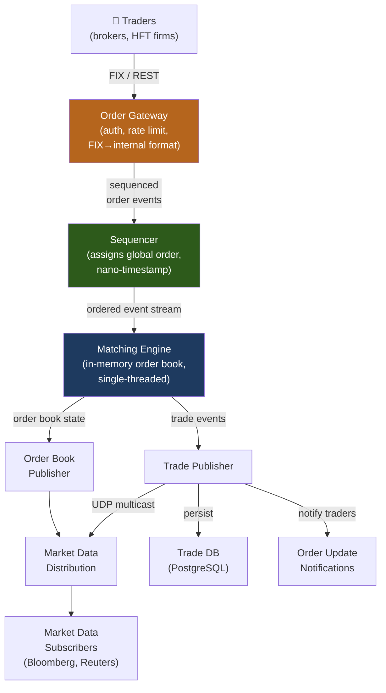
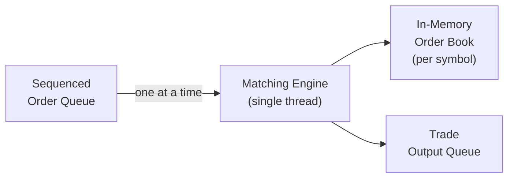
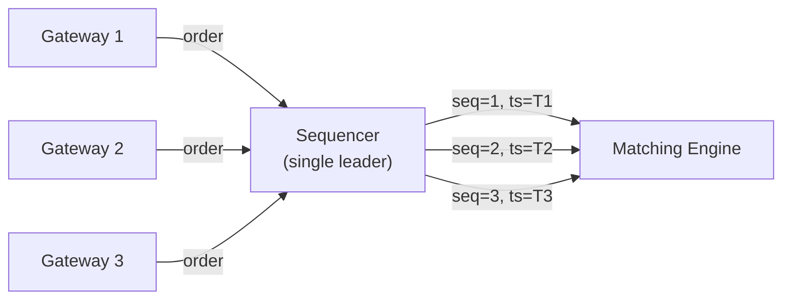
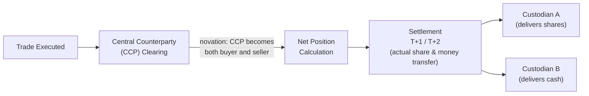

# Design a Stock Exchange / Trading System

A stock exchange matches buy and sell orders for financial instruments in real-time. This is one of the most demanding system design problems: it requires microsecond-level latency for the matching engine, strict ordering and atomicity guarantees, and regulatory compliance. Every design decision has direct financial consequences.

---

## Requirements

### Functional Requirements

1. Users can place market orders (execute immediately at best available price) and limit orders (execute only at a specified price or better).
2. Orders are matched against a live order book — an ordered list of outstanding buy/sell orders.
3. Matched orders generate trades; unmatched limit orders sit in the book until matched, cancelled, or expired.
4. Users can cancel pending orders.
5. Publish real-time trade feed and order book snapshots (market data).
6. *(Optional)* Support order types: stop-loss, fill-or-kill, iceberg orders.

### Non-Functional Requirements

- **Ultra-low latency** — order-to-match < 1 ms (exchange-grade: < 10 µs).
- **Strict ordering** — orders matched in price-time priority (FIFO within same price level).
- **Exactly-once matching** — an order must never be matched twice.
- **High availability** — any downtime is a regulatory and reputational catastrophe.
- **Auditability** — every order state change must be logged with nanosecond timestamps.

!!! note "Clarifying scope"
    Ask: *"Is this a full-scale exchange like NYSE, or a crypto exchange? Do we need co-location for HFT? Should I include clearing and settlement, or just the matching engine?"*

---

## Capacity Estimation

| Metric | Assumption | Result |
|--------|-----------|--------|
| Order rate | 500 k orders/sec (peak for major exchange) | — |
| Match rate | 200 k trades/sec | — |
| Order book depth | 10 k price levels × 2 sides | ~20 k entries per instrument |
| Instruments | 10 k listed symbols | — |
| Market data events | 500 k/sec × 10 k symbols | **~5 B events/sec** (multicast) |
| Audit log | 500 k events/sec × 200 bytes | **~100 MB/sec** |

!!! tip "Back-of-envelope shortcut"
    Latency matters more than throughput here. 500 k orders/sec is high but achievable; the hard part is ensuring the P99.99 latency stays in the microsecond range.

---

## API Design

```
# FIX protocol is industry standard for order entry
# REST API for retail/crypto exchanges

POST /api/v1/orders
Headers: Authorization: Bearer {token}
Body:  { "symbol": "AAPL", "side": "BUY", "order_type": "LIMIT", "quantity": 100, "price": 175.50, "time_in_force": "GTC" }
Response 200: { "order_id": "ord_abc", "status": "ACCEPTED", "timestamp_ns": 1700000000000000000 }

DELETE /api/v1/orders/{order_id}
Response 200: { "order_id": "ord_abc", "status": "CANCELLED" }

GET /api/v1/orderbook/{symbol}
Response 200:
{
  "symbol": "AAPL",
  "bids": [{ "price": 175.49, "quantity": 500 }, ...],
  "asks": [{ "price": 175.50, "quantity": 200 }, ...],
  "sequence": 1234567
}

# WebSocket for real-time market data:
wss://market-data.exchange.com/streams/{symbol}
```

---

## Data Model



**Storage choice:** Order and trade records in a high-performance relational DB (PostgreSQL with write-ahead log replication, or a purpose-built financial DB like SingleStore). The in-memory order book is the canonical state — the DB is an audit log and recovery point. Market data published via UDP multicast for co-located clients.

---

## High-Level Architecture



---

## Key Design Decisions

### The Matching Engine: Single-Threaded By Design

The matching engine is intentionally **single-threaded** and processes one event at a time:



**Why single-threaded?** Concurrent access to the order book requires locking, and lock contention at microsecond timescales is unacceptable. A single-threaded engine processes events sequentially with deterministic ordering — no race conditions, no locks, and simpler correctness reasoning. At 500 k orders/sec, a well-optimized single core can handle this workload.

### Order Book Data Structure

The order book maintains two sorted lists: bids (buy orders, descending price) and asks (sell orders, ascending price):

```
BID SIDE (buyers)         ASK SIDE (sellers)
Price   Quantity           Price   Quantity
175.50  200 ←best bid     175.51  300 ←best ask
175.49  500               175.52  800
175.48  1200              175.53  400
```

**Data structure:** Red-black tree (or skip list) keyed by price, with a FIFO queue at each price level. Gives O(log N) price insertion/deletion, O(1) best-bid/best-ask access.

**Matching logic:**
```
For a new BUY LIMIT order at price P:
  While ask_book.best_ask.price <= P and order.quantity > 0:
    execute_trade(order, ask_book.best_ask.front())
    if ask_book.best_ask.front().quantity == 0:
      ask_book.remove_best_ask_front()
  if order.quantity > 0:
    bid_book.insert(order)  # resting limit order
```

### Sequencer: The Global Order Guarantor

All orders must be globally sequenced before reaching the matching engine — ensuring deterministic replay and preventing split-brain:



The sequencer is the only stateful bottleneck. Implemented as a ring buffer in shared memory (kernel-bypass) for minimum latency. Failover: hot standby sequencer with synchronous log replication.

---

## Example Interview Dialog

> **Interviewer:** How do you ensure two market orders from different gateways don't race and both claim the same liquidity?

> **Candidate:** The sequencer is the serialization point. Every gateway sends orders to the sequencer, which assigns a monotonically increasing global sequence number with a nanosecond timestamp before the order enters the matching engine. The matching engine is single-threaded and processes events strictly in sequence order — so there is no concurrency at the matching layer. The race is resolved at the sequencer: whichever order arrives at the sequencer first gets the lower sequence number and therefore gets priority. This is price-time priority (FIFO) implemented correctly because time is established by the sequencer, not the gateway.

---

> **Interviewer:** What happens if the matching engine crashes and loses its in-memory order book state?

> **Candidate:** The matching engine is deterministic: given the same sequence of input events, it always produces the same output. So recovery is replay: all sequenced order events are persisted to a durable event log (write-ahead log, append-only). On restart, the engine replays the event log from the last checkpoint to rebuild the in-memory order book. To bound recovery time, I take periodic snapshots of the order book state (every N events), so replay only needs to start from the last snapshot plus subsequent events. With a checkpoint every 10 seconds and 500 k events/sec, recovery replays at most 5 M events — feasible in under a minute.

---

> **Interviewer:** How do you distribute real-time market data to thousands of subscribers efficiently?

> **Candidate:** For co-located subscribers (HFT firms on the same datacenter network), I use **UDP multicast** — the matching engine publishes trade and order book events to a multicast group, and all interested subscribers receive each packet simultaneously without any server-side fan-out. This scales to thousands of subscribers at essentially zero server overhead. For external subscribers (retail platforms, Bloomberg terminals), I use a market data distribution service that receives the multicast feed and retransmits over TCP to external clients. Missed packets in the multicast case are handled by requesting a retransmit or falling back to the order book snapshot API.

---

## Deep Dive: Order Types

| Order Type | Description | Matching behavior |
|-----------|-------------|------------------|
| **Market** | Execute immediately at best price | Matches against best available asks/bids; never rests |
| **Limit** | Execute only at price ≤ (buy) or ≥ (sell) | Rests in book if no match |
| **Stop** | Activates as market order when price reaches trigger | Inactive until trigger; then becomes market |
| **Fill-or-Kill** | Execute fully immediately or cancel entirely | Never rests; cancelled if not fully filled |
| **Iceberg** | Show only a portion of total quantity | Replenishes visible quantity automatically after fill |

---

## Deep Dive: Clearing and Settlement

After matching, trades must be settled — money and shares actually change hands:



**Netting:** If Trader A buys 100 AAPL and sells 80 AAPL during the day, only the net 20 shares need to move at settlement — dramatically reducing actual asset transfers.

---

[:octicons-arrow-left-24: Back: System Design Index](index.md)
