# Design Twitter / Social Media Feed

Designing a social media feed is one of the most common and nuanced system design interviews. It tests your ability to balance **read vs write trade-offs**, handle **celebrity/hotspot problems**, and design systems that serve personalized, ranked content at massive scale.

---

## Requirements

### Functional Requirements

1. Users can post tweets (text, images, links).
2. Users can follow/unfollow other users.
3. A user's **home timeline** shows tweets from everyone they follow, in reverse-chronological order (or ranked).
4. A user's **profile timeline** shows all tweets by a specific user.
5. *(Optional)* Like, retweet, reply.
6. *(Optional)* Search tweets.

### Non-Functional Requirements

- **Scale:** 300M daily active users, 500M tweets/day (~5 800 writes/sec), 300B timeline reads/day (~3.5M reads/sec).
- **Low latency:** Home timeline must load in < 200 ms (p99).
- **Eventual consistency:** It's acceptable if a new tweet appears in followers' feeds with a few seconds of delay.
- **High availability:** Feed must be available even during partial failures.

!!! note "Clarifying scope"
    Ask: *"Should I prioritize reverse-chronological feed or a ranked/ML feed? What is the expected follower count distribution — how many users have millions of followers?"*

---

## Capacity Estimation

| Metric | Assumption | Result |
|--------|-----------|--------|
| Tweet writes | 500M/day | **~5 800 writes/sec** |
| Timeline reads | 300B/day | **~3.5M reads/sec** |
| Avg follows per user | 200 | — |
| Fan-out writes/tweet | 5 800 × 200 avg follows | **~1.16M fan-out writes/sec** |
| Tweet size | 300 bytes | — |
| Storage per day | 500M × 300 B | **~150 GB/day** |

The read:write ratio is about **600:1** — this is heavily read-dominated, which drives toward **pre-computed timelines** (fan-out on write).

---

## Fan-Out Strategies

The core architectural decision: when a user posts a tweet, how do followers see it?

### Fan-Out on Write (Push Model)

When a tweet is created, **immediately push it to all followers' timeline caches**.

| Aspect | Result |
|--------|--------|
| **Read speed** | ✅ Very fast — pre-built timeline, just read from cache |
| **Write amplification** | ❌ High — 1 tweet → N writes (N = follower count) |
| **Celebrity problem** | ❌ Severe — 1 celebrity tweet → 100M cache writes |
| **Storage** | ❌ High — each tweet stored in millions of caches |
| **Best for** | Normal users with moderate follower counts |

---

### Fan-Out on Read (Pull Model)

When a user opens their timeline, **fetch tweets from each followed account on-the-fly**.

| Aspect | Result |
|--------|--------|
| **Read speed** | ❌ Slow — must query many accounts and merge at read time |
| **Write amplification** | ✅ None — write once to tweet store |
| **Celebrity problem** | ✅ No issue — celebrity tweets fetched on-demand |
| **Storage** | ✅ Low — tweet stored once |
| **Best for** | Accounts with very large follower counts (celebrities) |

---

### Hybrid Model (Twitter's Actual Approach)

Use **fan-out on write** for normal users, **fan-out on read** for celebrities (> ~10k followers).

!!! tip "The key insight"
    Pre-building timelines is a **space-time trade-off**. You pay storage and write amplification upfront to make reads fast. For celebrities, the write cost is too high, so you defer work to read time.

---

## Data Model

**Storage choices:**

- **Tweets / Users:** Sharded MySQL or Cassandra (wide-column, time-ordered by tweet_id).
- **Follow graph:** Graph DB (Neo4j) or adjacency list in Cassandra (partition by `follower_id`).
- **Timeline cache:** Redis sorted sets (`ZADD feed:{user_id} timestamp tweet_id`), capped at ~800 entries.

---

## High-Level Architecture

```mermaid
flowchart TD
    Client["👤 Client"] --> LB["Load Balancer / API Gateway"]

    LB --> WriteAPI["Write API\n(Post Tweet)"]
    LB --> ReadAPI["Read API\n(Get Timeline)"]

    WriteAPI --> TweetSvc["Tweet Service"]
    TweetSvc --> TweetDB["Tweet Store\n(Cassandra)"]
    TweetSvc --> MQ["Message Queue\n(Kafka)"]

    MQ --> FanOutSvc["Fan-Out Service"]
    FanOutSvc --> FollowDB["Follow Graph\n(Cassandra)"]
    FanOutSvc --> FeedCache["Feed Cache\n(Redis Cluster)"]

    ReadAPI --> TimelineSvc["Timeline Service"]
    TimelineSvc --> FeedCache
    TimelineSvc --> TweetDB
    TimelineSvc --> UserSvc["User Service\n(profile data)"]

    MQ --> NotifSvc["Notification Service"]
    NotifSvc --> Push["Push / Email / SMS"]

    style FeedCache fill:#b5651d,color:#fff
    style MQ fill:#2d5a1b,color:#fff
    style FanOutSvc fill:#1e3a5f,color:#fff
```

---

## Celebrity / Hotspot Problem

A celebrity with 50M followers posting one tweet would trigger **50M cache writes** in seconds — enough to overwhelm any fan-out system.

### Solutions

1. **Threshold-based routing:** Flag accounts with > N followers as celebrities; skip fan-out for their tweets. Inject their tweets into timelines at read time.
2. **Lazy fan-out:** Fan out celebrity tweets on-demand when a user opens their timeline (fan-out on first read, then cache the merged result briefly).
3. **Dedicated celebrity tweet cache:** Store recent tweets from all celebrities in a separate hot cache, separate from the per-user timeline caches.

!!! example "Interview framing"
    > *"To handle the celebrity problem, I'd mark users above a follower threshold as 'influencers' and exclude them from the write-path fan-out. When building a user's timeline at read time, I'd merge their pre-built feed cache with a real-time query for recent tweets from any influencers they follow. This adds one extra Redis lookup but avoids the catastrophic write amplification."*

---

## Example Interview Dialog

> **Interviewer:** How would you implement the "unread notification count" badge that shows up instantly after someone likes your tweet?

> **Candidate:** I'd use a **counter cache** in Redis, keyed by user — increment it on each like/mention event. When the user opens the app, they read the counter and then reset it to zero. The notification events themselves are written to a Cassandra table partitioned by `user_id`, so the full list is available when the user opens the notification panel. The counter increment is fire-and-forget via a Kafka consumer, so it doesn't add latency to the like action.

---

> **Interviewer:** How would you add a ranking/ML feed instead of purely reverse-chronological?

> **Candidate:** I'd introduce a **feed ranking service** between the fan-out stage and the final cache. Instead of storing tweet IDs sorted by timestamp, the fan-out service writes candidate tweet IDs to a **candidate pool** (e.g., last 200 tweets from follows). At read time, the timeline service passes this candidate pool to a ranking service that scores each tweet using lightweight ML features — engagement velocity, your relationship strength with the author, content type — and returns the top N. The ranked results are cached for a short TTL (e.g., 10 minutes) to avoid re-ranking on every scroll. This is essentially how Twitter's "For You" feed works.

---

## Deep Dive: Feed Ranking

```mermaid
flowchart LR
    Candidates["Candidate Tweets\n(200 from fan-out)"] --> Ranking["Ranking Service"]
    Ranking --> Features["Feature Extraction\n• Engagement velocity\n• Author relationship score\n• Content freshness\n• Media type"]
    Features --> Model["Lightweight ML Model\n(logistic regression /\ngradient boosting)"]
    Model --> TopN["Top 20 scored tweets"]
    TopN --> Cache["Cache for 10 min\n(per user)"]
    Cache --> Client["👤 Client"]
```

**Key signals used in production ranking systems:**

| Signal | Description |
|--------|-------------|
| Engagement velocity | Likes/retweets per minute since posting |
| Author relationship | How often you interact with this author |
| Content freshness | Recency — decays over time |
| Social proof | Engagement from people you follow |
| Content type | Video/image vs text-only |

---

[:octicons-arrow-left-24: Back: Rate Limiter](rate-limiter.md) · [:octicons-arrow-right-24: Next: Web Crawler](web-crawler.md)
