# Design a URL Shortener (e.g., TinyURL / Bit.ly)

A URL shortener converts a long URL into a compact alias that redirects to the original. This is a classic system design problem that tests hashing, storage, caching, and redirection at scale.

---

## Requirements

### Functional Requirements

1. Given a long URL, generate a unique short URL (alias).
2. Redirect users from the short URL to the original long URL.
3. *(Optional)* Allow custom aliases (e.g., `bit.ly/my-promo`).
4. *(Optional)* Set an expiration time on short URLs.
5. *(Optional)* Provide click analytics (total clicks, referrer, geo).

### Non-Functional Requirements

- **High availability** — redirection must be near-100% uptime.
- **Low latency** — redirection should complete in < 10 ms (cache-hit path).
- **Durability** — short-to-long URL mappings must never be lost.
- **Scale** — support 100M new URLs/day, 10B redirects/day.

!!! note "Clarifying scope"
    In an interview, ask: *"Should I focus on the shortening + redirection path, or also on analytics? Are custom aliases in scope?"*

---

## Capacity Estimation

| Metric | Assumption | Result |
|--------|-----------|--------|
| Write QPS | 100M new URLs / 86 400 s | **~1 160 writes/sec** |
| Read QPS | 10B redirects / 86 400 s | **~115 700 reads/sec** (100:1 read:write) |
| Storage per URL | 500 bytes (long URL + metadata) | — |
| Storage per year | 100M/day × 365 × 500 B | **~18 TB/year** |
| Cache size (80/20 rule) | 20% of daily reads × 500 B | **~100 GB working set** |

!!! tip "Back-of-envelope shortcut"
    1 day ≈ 86 400 s ≈ 10⁵ s. Use 100 000 for quick mental math.

---

## API Design

```
POST /api/v1/urls
Body:  { "long_url": "https://...", "custom_alias": "my-link", "ttl_days": 30 }
Response 201: { "short_url": "https://short.ly/aB3xY9", "expires_at": "2025-01-01" }

GET /{short_code}
Response 301/302: Location: https://original-long-url.com/...

GET /api/v1/urls/{short_code}/stats
Response 200: { "clicks": 12345, "created_at": "...", "top_referrers": [...] }

DELETE /api/v1/urls/{short_code}
Response 204
```

---

## Data Model


**Storage choice:** The URL mapping is a simple key-value lookup (`short_code → long_url`). Use a **NoSQL store** (e.g., DynamoDB, Cassandra) for the hot path — the access pattern is a pure key lookup with no JOINs. Click events are append-only and suit a columnar/time-series store or data warehouse.

---

## High-Level Architecture

```mermaid
flowchart TD
    Client["👤 Client\n(Browser / App)"] --> LB["Load Balancer"]
    LB --> API["API Servers\n(Stateless)"]
    API -->|"short_code lookup"| Cache["Redis Cache\n(short_code → long_url)"]
    Cache -->|"Cache miss"| DB["NoSQL Store\n(URL Mappings)"]
    API -->|"write new URL"| DB
    API -->|"async click event"| MQ["Message Queue\n(Kafka)"]
    MQ --> Analytics["Analytics Service\n(ClickHouse / BigQuery)"]
    DB -->|"populate cache"| Cache

    style Cache fill:#b5651d,color:#fff
    style DB fill:#1e3a5f,color:#fff
    style MQ fill:#2d5a1b,color:#fff
```



---

## Key Design Decisions

### Hash Generation Strategies

How do we convert a long URL into a short 6–8 character code?

```mermaid
flowchart TD
    A["Need a short_code for long URL"] --> B{"Strategy?"}
    B -->|"Option 1"| Hash["MD5 / SHA-256\nof long URL\n→ take first 6 chars"]
    B -->|"Option 2"| Counter["Auto-increment ID\n→ Base62 encode"]
    B -->|"Option 3"| UUID["UUID\n→ Base62 first 8 chars"]

    Hash --> H_Pro["✅ Deterministic\n(same URL = same code)"]
    Hash --> H_Con["❌ Collision risk\n❌ Hard to shard"]
    Counter --> C_Pro["✅ No collision\n✅ Easy to shard by range"]
    Counter --> C_Con["❌ Predictable (enumerable)\n❌ Counter is a bottleneck"]
    UUID --> U_Pro["✅ No central coordinator"]
    UUID --> U_Con["❌ Long (need truncation)\n❌ Collision possible"]
```



**Recommended approach:** Use a **distributed ID generator** (e.g., Twitter Snowflake, or a simple DB sequence sharded across multiple generators) then **Base62-encode** the numeric ID.

Base62 alphabet: `0-9A-Za-z` → 62 characters. A 7-character Base62 string gives 62⁷ ≈ 3.5 trillion combinations.

### 301 vs 302 Redirect

| Code | Name | Browser Behavior | Use When |
|------|------|-----------------|----------|
| **301** | Moved Permanently | Browser caches the redirect; future requests skip your server | You want to offload traffic; analytics don't matter |
| **302** | Found (Temporary) | Browser always asks your server | You need to log every click for analytics |

!!! warning "301 breaks analytics"
    If you return 301, browsers cache the redirect and future clicks **never reach your servers**. Use **302** if click tracking is a requirement.

### Analytics Pipeline

Writes to the analytics store happen **asynchronously** via a message queue to avoid adding latency to the redirect hot path:

```
Redirect request
  → API server returns 302 immediately
  → Publishes { short_code, ip, referrer, timestamp } to Kafka
  → Analytics consumer writes to ClickHouse / BigQuery
```

---

## Example Interview Dialog

> **Interviewer:** How would you handle two users submitting the same long URL — should they get the same short code?

> **Candidate:** That's a trade-off. If we hash the long URL deterministically, same URL → same code, saving storage. But it means the same code is shared across users, which complicates ownership and deletion semantics. My default is to generate a **unique code per request** — storage is cheap, and it makes permission management cleaner. I'd only deduplicate if storage cost was a hard constraint.

---

> **Interviewer:** What happens if the Redis cache goes down?

> **Candidate:** The redirect path falls back to the database, which can still serve the requests — just with higher latency. At ~115k reads/sec the DB will be under heavy load. To mitigate: First, I'd run Redis in **cluster mode with replicas** so a single node failure doesn't take down the whole cache. Second, I'd add a **local in-process LRU cache** on each API server for the hottest ~10k URLs, so even a full Redis outage only degrades to DB reads for the long tail.

---

## Deep Dive: Caching Layer

**Cache population strategy:** Cache-aside (lazy loading).

1. Redirect request arrives for `aB3xY9`.
2. API server checks Redis — **cache hit** → return `long_url` immediately (< 1 ms).
3. **Cache miss** → query DB → store result in Redis with TTL = 24 h → return `long_url`.

**Eviction policy:** `allkeys-lru` in Redis. The working set of popular URLs stays hot; expired URLs are evicted automatically.

**TTL consideration:** Match the cache TTL to URL expiration. If a URL expires, the cache should not serve a stale redirect. On URL deletion/expiry, explicitly `DEL` the Redis key.

---

## Deep Dive: Database Sharding

At 18 TB/year, a single DB node becomes a bottleneck. Shard by `short_code`:


**Shard key choice:** `short_code` distributes writes and reads evenly. Avoid sharding by `user_id` — a viral user would hotspot a single shard.

**Alternative:** Use **consistent hashing** so adding/removing shards minimally remaps keys (see [Distributed Cache](distributed-cache.md)).

---

[:octicons-arrow-left-24: Back: System Design Index](index.md) · [:octicons-arrow-right-24: Next: Rate Limiter](rate-limiter.md)
