# Design Video Streaming (e.g., YouTube / Netflix)

A video streaming platform must ingest user-uploaded content, transcode it into multiple resolutions and formats, store it efficiently, and deliver it to millions of concurrent viewers with adaptive quality. This problem spans upload pipelines, distributed storage, CDNs, and bitrate adaptation.

---

## Requirements

### Functional Requirements

1. Users can upload videos (up to 10 GB per file).
2. Videos are processed and available for playback within minutes of upload.
3. Playback adapts to the viewer's available bandwidth (adaptive bitrate).
4. Support pause, resume, seek within a video.
5. *(Optional)* Recommendations, comments, likes.
6. *(Optional)* Live streaming.

### Non-Functional Requirements

- **High availability** — playback failures are immediately visible and costly.
- **Scalability** — 1 B daily active users, 500 hours of video uploaded per minute.
- **Low latency** — video should start playing within 2 seconds ("time-to-first-frame").
- **Durability** — uploaded video must never be lost.

!!! note "Clarifying scope"
    Ask: *"Should I include the recommendation system? Is live streaming in scope, or just on-demand?"*

---

## Capacity Estimation

| Metric | Assumption | Result |
|--------|-----------|--------|
| Upload rate | 500 hrs video / min | ~300 GB raw video/min ingested |
| Transcoded size | 1 hr video → ~1 GB (multi-res) | ~500 GB/min to store |
| Storage per year | 500 GB/min × 525 600 min | **~263 PB/year** |
| Streaming QPS | 1 B users × 2 views/day / 86 400 s | **~23 000 stream starts/sec** |
| CDN bandwidth | 23 000 streams × 5 Mbps avg | **~115 Tbps peak CDN egress** |

!!! tip "Back-of-envelope shortcut"
    CDN egress is the dominant cost driver. Negotiate CDN contracts early; it often represents 40–60% of total infrastructure spend.

---

## API Design

```
POST /api/v1/videos/upload-url
Body:  { "filename": "vacation.mp4", "size_bytes": 1073741824 }
Response 200: { "upload_id": "u_abc123", "upload_url": "https://storage.../presigned" }

POST /api/v1/videos/upload-url/complete
Body:  { "upload_id": "u_abc123", "title": "My Vacation", "description": "..." }
Response 202: { "video_id": "v_xyz789", "status": "processing" }

GET /api/v1/videos/{video_id}
Response 200: { "video_id": "v_xyz789", "title": "...", "manifest_url": "https://cdn.../hls/master.m3u8", "status": "ready" }

GET /api/v1/videos/{video_id}/stream
Response 302: Location: https://cdn.example.com/videos/v_xyz789/hls/master.m3u8
```

---

## Data Model


**Storage choice:** Metadata in a relational DB (PostgreSQL). Raw and transcoded video blobs in object storage (S3/GCS). Manifests (`.m3u8` / `.mpd` files) also stored in object storage and served via CDN.

---

## High-Level Architecture


---

## Key Design Decisions

### Adaptive Bitrate Streaming: HLS vs. DASH

| Protocol | Full Name | Segment Format | Client Support |
|----------|-----------|---------------|---------------|
| **HLS** | HTTP Live Streaming | `.ts` / fMP4 | Native iOS/macOS; wide support |
| **DASH** | Dynamic Adaptive Streaming over HTTP | fMP4 | Android, browsers (via MSE) |
| **CMAF** | Common Media Application Format | fMP4 | Both — single set of segments |

**Recommended:** Encode once to CMAF fMP4 segments and serve both an HLS `.m3u8` and a DASH `.mpd` manifest pointing to the same files.

### Transcoding Pipeline


Parallelizing segment transcoding across workers dramatically reduces processing time — a 1-hour video can be transcoded in ~5 minutes with sufficient parallelism.

### Upload Strategy: Chunked / Resumable

Large files (up to 10 GB) must support resumable uploads:

1. Client requests a presigned resumable upload URL.
2. Client uploads in 5–25 MB chunks, tracking the last confirmed offset.
3. If the connection drops, the client resumes from the last confirmed offset.
4. On completion, the server triggers a Kafka event to start transcoding.

---

## Example Interview Dialog

> **Interviewer:** How would you design the transcoding pipeline to handle spikes — say, a popular creator uploading many videos at once?

> **Candidate:** The transcoding queue is backed by Kafka. When uploads land in object storage, an event is published and consumed by a pool of transcoding workers. Workers are stateless and scale horizontally using auto-scaling — I'd configure a cloud managed service like AWS Elemental MediaConvert or a Kubernetes job queue that spins up pods based on queue depth. During a spike, the queue absorbs the burst while workers catch up; the creator sees their video in "processing" state until it's done.

---

> **Interviewer:** How does adaptive bitrate streaming work from the viewer's perspective?

> **Candidate:** The player downloads the master manifest (`.m3u8`), which lists all available bitrate variants. It starts by requesting the lowest bitrate to get the video started quickly. A bandwidth estimation algorithm runs continuously — measuring download speed for each segment — and switches up or down to a higher or lower bitrate variant at each segment boundary (every 6–10 seconds). This all happens over plain HTTP, so no special server-side state is needed; the CDN just serves static segment files.

---

> **Interviewer:** How do you ensure a video uploaded by a creator is never lost?

> **Candidate:** Object storage like S3 provides 11 nines of durability through cross-AZ replication. After upload, the raw file is immediately replicated to a second geographic region as a disaster-recovery copy. The transcoded segments are also replicated. Before deleting the raw file post-transcoding, I'd keep it for at least 30 days to allow re-transcoding if a new codec or resolution target is added. Deletion of raw files is gated on a manual approval process in the data pipeline.

---

## Deep Dive: CDN Strategy

```mermaid
flowchart LR
    Origin["Origin Object Store\n(S3)"] -->|"cache fill"| Edge1["CDN PoP\nNew York"]
    Origin -->|"cache fill"| Edge2["CDN PoP\nLondon"]
    Origin -->|"cache fill"| Edge3["CDN PoP\nTokyo"]
    Edge1 --> V1["👤 US Viewer"]
    Edge2 --> V2["👤 EU Viewer"]
    Edge3 --> V3["👤 Asia Viewer"]
```



**Cache TTL:** Segments are immutable once written (`video_id/segment_00023.ts`). Set `Cache-Control: max-age=31536000, immutable`. Manifests are also immutable per version — use versioned URLs for any manifest regeneration.

**Cache hit rate target:** > 95%. Segments are small (< 5 MB each) and the popularity distribution is heavily skewed (top 1% of videos account for ~90% of views).

---

## Deep Dive: Video Processing States


Expose `status` via the metadata API so the creator's dashboard can show a progress indicator. Use a Server-Sent Events or WebSocket endpoint to push status changes to the creator UI without polling.

---

[:octicons-arrow-left-24: Back: System Design Index](index.md)
