# Design a Web Crawler

A web crawler (spider) systematically browses the internet, downloading pages to build a search index, train ML models, or monitor content. This problem tests your understanding of distributed systems, deduplication, politeness, and BFS/DFS at internet scale.

---

## Requirements

### Focused Crawl vs. Broad Crawl

| Type | Scope | Scale | Use Case |
|------|-------|-------|----------|
| **Focused crawl** | Specific domains or topics | Thousands of URLs | Price monitoring, news aggregation, research |
| **Broad crawl** | Entire web | Billions of URLs | Search engines (Google, Bing), Common Crawl |

!!! note "Clarifying scope"
    Ask: *"Is this for indexing the full public web (like Googlebot) or a focused domain-specific crawler? How fresh does the content need to be — crawling once vs continuous re-crawling?"*

For this design we focus on a **large-scale broad crawler** targeting billions of pages.

### Functional Requirements

1. Seed the crawler with a set of starting URLs.
2. Fetch and parse HTML pages, extracting links.
3. Deduplicate URLs — never fetch the same URL twice unnecessarily.
4. Respect `robots.txt` and crawl politeness policies.
5. Store raw HTML and extracted content for downstream indexing.
6. Re-crawl pages periodically to detect updates.

### Non-Functional Requirements

- **Scale:** Crawl 1 billion pages; average page size 100 KB → ~100 TB storage.
- **Throughput:** Crawl ~1 000 pages/sec (per crawler node), 100+ nodes → ~100 000 pages/sec.
- **Politeness:** No more than 1 request per domain per second.
- **Robustness:** Survive partial failures; resume without duplicate work.
- **Extensibility:** Easy to plug in new parsers (PDF, JSON, XML).

---

## Capacity Estimation

| Metric | Assumption | Result |
|--------|-----------|--------|
| Pages to crawl | 1 billion | — |
| Avg page size | 100 KB | — |
| Total storage (raw HTML) | 1B × 100 KB | **~100 TB** |
| Re-crawl frequency | Monthly | **~385 pages/sec sustained** |
| Peak throughput (100 nodes) | 1 000 pages/sec × 100 | **~100 000 pages/sec** |
| URLs in frontier | 10 billion (seen + pending) | **~1 TB for URL metadata** |
| DNS lookups | ~100 000/sec | Need aggressive DNS caching |

---

## Components

```mermaid
flowchart TD
    Frontier["🗂️ URL Frontier\n(Priority Queue)"] -->|"next URL to crawl"| Scheduler["Scheduler\n(politeness + priority)"]
    Scheduler --> Fetcher["🌐 HTML Fetcher\n(HTTP client)"]
    Fetcher -->|"DNS lookup"| DNS["DNS Resolver\n(local cache)"]
    DNS --> Fetcher
    Fetcher -->|"raw HTML"| Parser["🔍 HTML Parser\n(link extractor)"]
    Parser -->|"extracted links"| Dedup["Dedup Filter\n(Bloom filter + URL DB)"]
    Dedup -->|"new URLs"| Frontier
    Parser -->|"page content"| ContentDedup["Content Dedup\n(SimHash)"]
    ContentDedup -->|"unique content"| Storage["📦 Content Store\n(S3 / HDFS)"]
    Storage --> IndexQueue["Index Queue\n(Kafka)"]
    IndexQueue --> Indexer["Search Indexer\n(downstream)"]
```



| Component | Responsibility |
|-----------|---------------|
| **URL Frontier** | Prioritized queue of URLs to crawl; enforces politeness per domain |
| **Scheduler** | Picks next URL respecting per-domain rate limits |
| **HTML Fetcher** | Makes HTTP GET requests; handles redirects, timeouts, robots.txt |
| **DNS Resolver** | Translates hostnames to IPs; heavily cached (10-min TTL) |
| **HTML Parser** | Extracts links, title, and content from raw HTML |
| **Dedup Filter** | Rejects already-seen URLs before re-adding to frontier |
| **Content Dedup** | Detects near-duplicate pages (mirrors, spam) |
| **Content Store** | Durable raw HTML storage for downstream indexing |

---

## Crawl Loop Flowchart


---

## Architecture Diagram


---

## Politeness Policies

A well-behaved crawler avoids hammering any single server:

1. **robots.txt:** Fetch and cache `https://example.com/robots.txt` on first visit. Respect `Disallow` rules and `Crawl-delay` directives.
2. **Per-domain rate limit:** Never send more than 1 request/sec to the same domain (configurable). Enforce using the rate limiter layer.
3. **Crawl-Delay header:** Honor `Crawl-Delay` from robots.txt (e.g., `Crawl-delay: 10`).
4. **User-Agent identification:** Identify the bot honestly: `Mozilla/5.0 (compatible; MyCrawler/1.0; +https://example.com/bot)`.
5. **Nofollow / Noindex:** Respect `<meta name="robots" content="noindex,nofollow">` tags.

```
# Example robots.txt
User-agent: *
Disallow: /admin/
Disallow: /private/
Crawl-delay: 5

User-agent: MyCrawler
Allow: /public/
```

---

## URL Deduplication

At billions of URLs, storing every seen URL in memory is not feasible. Two-tier approach:

### Tier 1: Bloom Filter (in-memory)

A Bloom filter can check URL membership with **O(1) time** and **sub-byte memory per URL**. False positives (claiming a new URL was already seen) are acceptable — we just miss crawling it. False negatives are impossible.

- **10 billion URLs at 1% false positive rate** → ~12 GB Bloom filter.

### Tier 2: URL Database (Cassandra)

For URLs that pass the Bloom filter check, do a precise lookup in a Cassandra table to confirm. Store crawl metadata: last crawled time, HTTP status, content hash.

---

## Content Deduplication (SimHash)

Many pages have near-identical content (mirrors, scrapers, pagination). Use **SimHash** to detect near-duplicates:

1. Extract tokens from page content.
2. Compute a 64-bit SimHash fingerprint.
3. Two pages are near-duplicates if their SimHash **Hamming distance ≤ 3**.
4. Store fingerprints in a lookup table; query on each new page.

---

## Distributed Crawling with Consistent Hashing

Assign URL domains to crawler nodes using consistent hashing so that:

- **All requests to a given domain go to the same node** — simplifying per-domain rate limiting.
- **Adding/removing nodes** remaps only a fraction of domains.


---

## Example Interview Dialog

> **Interviewer:** What happens when a page redirects? How many redirects do you follow?

> **Candidate:** I'd follow up to **5 redirects** before giving up, which handles the vast majority of real-world redirect chains. Each intermediate URL in the chain gets added to the URL-seen set so we don't follow the same chain twice. Critically, I'd also check that the final destination URL passes the dedup filter — it's common for multiple source URLs to redirect to the same canonical page.

---

> **Interviewer:** How do you decide which URLs to crawl first?

> **Candidate:** The URL frontier is a **priority queue**. I'd score URLs on a combination of: (1) **estimated PageRank** — pages linked from high-authority sites get higher priority; (2) **content freshness** — pages we haven't crawled recently; (3) **domain diversity** — avoid spending all slots on one domain. In practice, I'd use a two-level queue: a high-priority queue for seeds and high-PageRank pages, and a lower-priority queue for the long tail. The scheduler picks from the high-priority queue 90% of the time.

---

> **Interviewer:** How do you handle dynamic JavaScript-rendered content?

> **Candidate:** Traditional HTTP fetchers only get the initial HTML, missing content rendered by JavaScript. For JS-heavy pages, I'd use a **headless browser tier** (Puppeteer/Playwright) that actually executes JavaScript. This is expensive — maybe 10× the CPU cost of a plain HTTP fetch — so I'd route only a fraction of URLs to this tier, prioritizing high-value domains. The headless browser tier runs as a separate worker pool, and the main crawler submits JS-render jobs to it asynchronously.

---

[:octicons-arrow-left-24: Back: Twitter Feed](twitter-feed.md) · [:octicons-arrow-right-24: Next: Notification System](notification-system.md)
